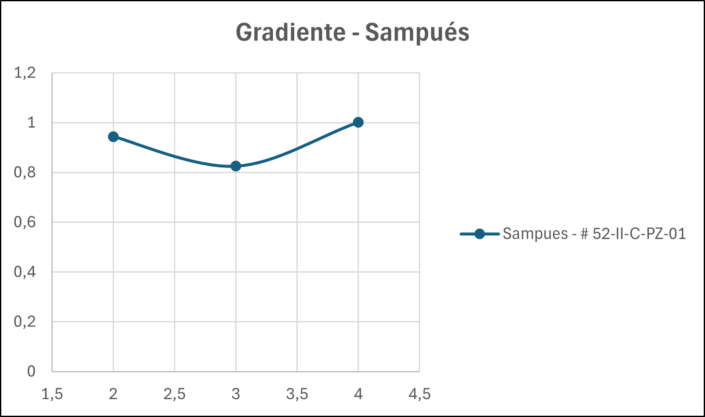
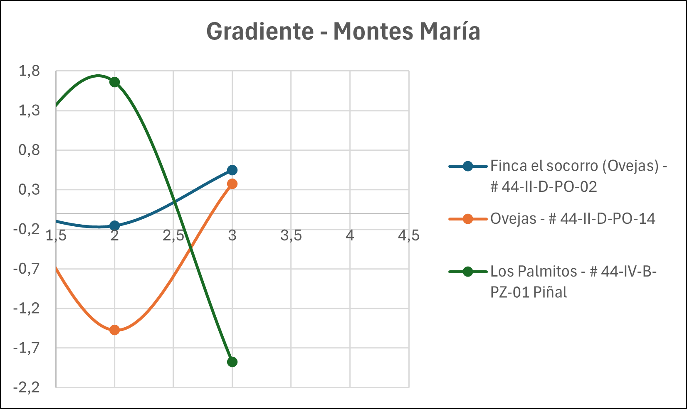
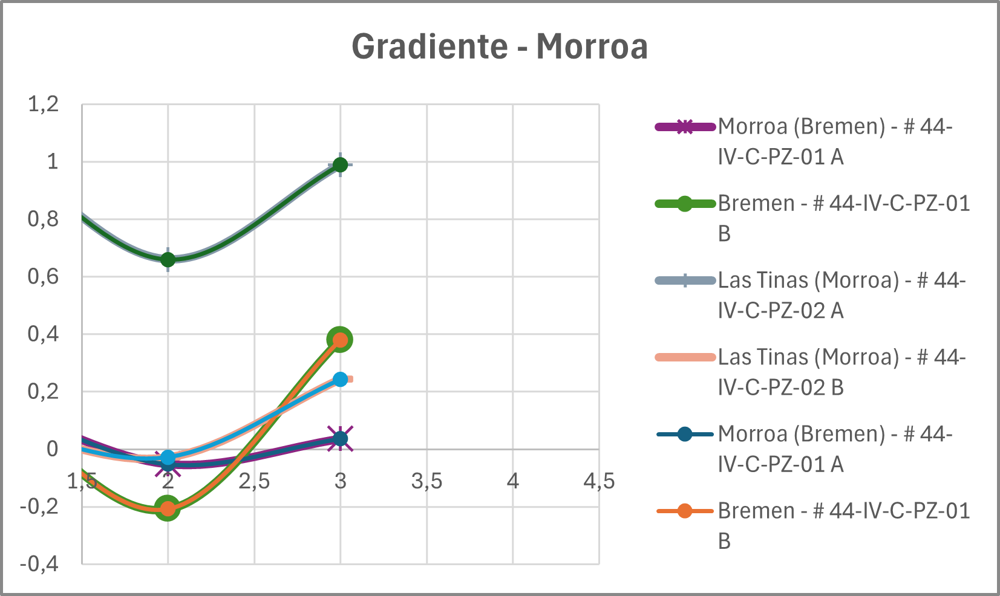

# Monitoreo de Pozos - Sucre

Este repositorio contiene los datos del monitoreo de posos en el departamento de Sucre, Colombia. Se incluyen registros históricos de niveles piezométricos, diferencias temporales y gradientes para diferentes puntos de muestreo distribuidos en la región.

---

## Tabla de Contenido

1. [Introducción](#introducción)
2. [Puntos de Muestreo](#puntos-de-muestreo)
   - [Sampués](#sampués)
   - [Ovejas](#ovejas)
   - [Los Palmitos](#los-palmitos)
   - [Morroa](#morroa)
   - [Corozal](#corozal)
3. [Análisis de Gradientes](#análisis-de-gradientes)
4. [Análisis por Zonas](#análisis-por-zonas)

---

## Introducción

Los datos presentados corresponden a mediciones de nivel piezométrico en diferentes posos distribuidos en el departamento de Sucre. Las columnas incluyen:

- **Fecha inicial y final**: Período de medición
- **Nivel (m)**: Valor del nivel piezométrico
- **Diferencia**: Cambio total entre la medición inicial y final
- **Períodos quinquenales**: Variación en cada período de 5 años
- **Gradientes**: Gradiente hidráulico calculado para cada período

---

## Puntos de Muestreo

### Sampués

| Código | # 52-II-C-PZ-01 |
|--------|-----------------|
| Fecha Inicial | 15/02/2010 |
| Fecha Final | 11/11/2025 |
| **Nivel Inicial (m)** | **34,45** |
| **Nivel Final (m)** | **49,13** |
| **Diferencia Total** | **14,68** |

**Variación por Período:**

| Período | Variación (m) |
|---------|---------------|
| 2010-2015 | 4,72 |
| 2015-2020 | 4,13 |
| 2020-2025 | 5,01 |

**Gradientes:**

| Período | Gradiente |
|---------|-----------|
| 2010_2015 | 0,944 |
| 2015_2020 | 0,8255 |
| 2020_2025 | 1,0011 |

---

### Ovejas

#### Finca el Socorro

| Código | # 44-II-D-PO-02 |
|--------|-----------------|
| Fecha Inicial | 17/03/2010 |
| Fecha Final | 11/10/2025 |
| **Nivel Inicial (m)** | **10,27** |
| **Nivel Final (m)** | **12,55** |
| **Diferencia Total** | **2,28** |

**Variación por Período:**

| Período | Variación (m) |
|---------|---------------|
| 2010-2015 | 0,37 |
| 2015-2020 | -0,78 |
| 2020-2025 | 2,73 |

**Gradientes:**

| Período | Gradiente |
|---------|-----------|
| 2010_2015 | 0,0748 |
| 2015_2020 | -0,156 |
| 2020_2025 | 0,546 |

---

#### Ovejas

| Código | # 44-II-D-PO-14 |
|--------|-----------------|
| Fecha Inicial | 28/04/2010 |
| Fecha Final | 30/09/2025 |
| **Nivel Inicial (m)** | **8,11** |
| **Nivel Final (m)** | **7,48** |
| **Diferencia Total** | **-0,63** |

**Variación por Período:**

| Período | Variación (m) |
|---------|---------------|
| 2010-2015 | 2,88 |
| 2015-2020 | -7,37 |
| 2020-2025 | 1,89 |

**Gradientes:**

| Período | Gradiente |
|---------|-----------|
| 2010_2015 | 0,576 |
| 2015_2020 | -1,4734 |
| 2020_2025 | 0,3773 |

---

### Los Palmitos

| Código | # 44-IV-B-PZ-01 Piñal |
|--------|----------------------|
| Fecha Inicial | 15/02/2010 |
| Fecha Final | 10/11/2025 |
| **Nivel Inicial (m)** | **72,08** |
| **Nivel Final (m)** | **74,45** |
| **Diferencia Total** | **2,37** |

**Variación por Período:**

| Período | Variación (m) |
|---------|---------------|
| 2010-2015 | 2,41 |
| 2015-2020 | 8,30 |
| 2020-2025 | -9,38 |

**Gradientes:**

| Período | Gradiente |
|---------|-----------|
| 2010_2015 | 0,482 |
| 2015_2020 | 1,66 |
| 2020_2025 | -1,875 |

---

### Morroa

#### Morroa (Bremen) - Punto A

| Código | # 44-IV-C-PZ-01 A |
|--------|-------------------|
| Fecha Inicial | 12/01/2010 |
| Fecha Final | 10/11/2025 |
| **Nivel Inicial (m)** | **4,59** |
| **Nivel Final (m)** | **5,65** |
| **Diferencia Total** | **1,06** |

**Variación por Período:**

| Período | Variación (m) |
|---------|---------------|
| 2010-2015 | 0,77 |
| 2015-2020 | -0,26 |
| 2020-2025 | 0,18 |

**Gradientes:**

| Período | Gradiente |
|---------|-----------|
| 2010_2015 | 0,154 |
| 2015_2020 | -0,052 |
| 2020_2025 | 0,036 |

---

#### Bremen - Punto B

| Código | # 44-IV-C-PZ-01 B |
|--------|-------------------|
| Fecha Inicial | 12/01/2010 |
| Fecha Final | 10/11/2025 |
| **Nivel Inicial (m)** | **4,59** |
| **Nivel Final (m)** | **6,34** |
| **Diferencia Total** | **1,75** |

**Variación por Período:**

| Período | Variación (m) |
|---------|---------------|
| 2010-2015 | 0,79 |
| 2015-2020 | -1,04 |
| 2020-2025 | 1,90 |

**Gradientes:**

| Período | Gradiente |
|---------|-----------|
| 2010_2015 | 0,158 |
| 2015_2020 | -0,208 |
| 2020_2025 | 0,38 |

---

#### Las Tinas (Morroa) - Punto A

| Código | # 44-IV-C-PZ-02 A |
|--------|-------------------|
| Fecha Inicial | 06/01/2010 |
| Fecha Final | 10/11/2025 |
| **Nivel Inicial (m)** | **37,63** |
| **Nivel Final (m)** | **51,95** |
| **Diferencia Total** | **14,32** |

**Variación por Período:**

| Período | Variación (m) |
|---------|---------------|
| 2010-2015 | 5,22 |
| 2015-2020 | 3,30 |
| 2020-2025 | 4,95 |

**Gradientes:**

| Período | Gradiente |
|---------|-----------|
| 2010_2015 | 1,043 |
| 2015_2020 | 0,66 |
| 2020_2025 | 0,99 |

---

#### Las Tinas (Morroa) - Punto B

| Código | # 44-IV-C-PZ-02 B |
|--------|-------------------|
| Fecha Inicial | 18/02/2010 |
| Fecha Final | 10/11/2025 |
| **Nivel Inicial (m)** | **2,89** |
| **Nivel Final (m)** | **4,56** |
| **Diferencia Total** | **1,67** |

**Variación por Período:**

| Período | Variación (m) |
|---------|---------------|
| 2010-2015 | 0,37 |
| 2015-2020 | -0,14 |
| 2020-2025 | 1,22 |

**Gradientes:**

| Período | Gradiente |
|---------|-----------|
| 2010_2015 | 0,074 |
| 2015_2020 | -0,028 |
| 2020_2025 | 0,244 |

---

### Corozal

#### Arroyo Salida a Betulia - Punto A

| Código | # 44-IV-D-PZ-01 A |
|--------|-------------------|
| Fecha Inicial | 05/02/2010 |
| Fecha Final | 11/11/2025 |
| **Nivel Inicial (m)** | **43,56** |
| **Nivel Final (m)** | **59,97** |
| **Diferencia Total** | **16,41** |

**Variación por Período:**

| Período | Variación (m) |
|---------|---------------|
| 2010-2015 | 4,87 |
| 2015-2020 | 4,12 |
| 2020-2025 | 7,10 |

**Gradientes:**

| Período | Gradiente |
|---------|-----------|
| 2010_2015 | 0,974 |
| 2015_2020 | 0,824 |
| 2020_2025 | 1,42 |

---

#### Arroyo Salida a Betulia - Punto B

| Código | # 44-IV-D-PZ-01 B |
|--------|-------------------|
| Fecha Inicial | 18/02/2010 |
| Fecha Final | 20/12/2025 |
| **Nivel Inicial (m)** | **6,94** |
| **Nivel Final (m)** | **9,14** |
| **Diferencia Total** | **2,20** |

**Variación por Período:**

| Período | Variación (m) |
|---------|---------------|
| 2010-2015 | 0,16 |
| 2015-2020 | 0,68 |
| 2020-2025 | 2,25 |

**Gradientes:**

| Período | Gradiente |
|---------|-----------|
| 2010_2015 | 0,032 |
| 2015_2020 | 0,136 |
| 2020_2025 | 0,45 |

---

#### Sabanas de Cali (El Tesoro) - Punto A

| Código | # 44-IV-D-PZ-02 |
|--------|-----------------|
| Fecha Inicial | 12/01/2010 |
| Fecha Final | 18/10/2025 |
| **Nivel Inicial (m)** | **89,70** |
| **Nivel Final (m)** | **115,37** |
| **Diferencia Total** | **25,67** |

**Variación por Período:**

| Período | Variación (m) |
|---------|---------------|
| 2010-2015 | 7,40 |
| 2015-2020 | 9,71 |
| 2020-2025 | 8,05 |

**Gradientes:**

| Período | Gradiente |
|---------|-----------|
| 2010_2015 | 1,48 |
| 2015_2020 | 1,942 |
| 2020_2025 | 1,61 |

---

#### Sabanas de Cali (El Tesoro) - Punto B

| Código | # 44-IV-D-PZ-04 |
|--------|-----------------|
| Fecha Inicial | 12/01/2010 |
| Fecha Final | 17/11/2025 |
| **Nivel Inicial (m)** | **59,55** |
| **Nivel Final (m)** | **70,15** |
| **Diferencia Total** | **10,60** |

**Variación por Período:**

| Período | Variación (m) |
|---------|---------------|
| 2010-2015 | 0,57 |
| 2015-2020 | 4,32 |
| 2020-2025 | 5,35 |

**Gradientes:**

| Período | Gradiente |
|---------|-----------|
| 2010_2015 | 0,114 |
| 2015_2020 | 0,864 |
| 2020_2025 | 1,07 |

---

#### Basurero Viejo, Pileta - Punto A

| Código | # 52-II-B-PZ-01 A |
|--------|-------------------|
| Fecha Inicial | 05/02/2010 |
| Fecha Final | 11/11/2025 |
| **Nivel Inicial (m)** | **36,10** |
| **Nivel Final (m)** | **43,72** |
| **Diferencia Total** | **7,62** |

**Variación por Período:**

| Período | Variación (m) |
|---------|---------------|
| 2010-2015 | 2,44 |
| 2015-2020 | 2,66 |
| 2020-2025 | 1,85 |

**Gradientes:**

| Período | Gradiente |
|---------|-----------|
| 2010_2015 | 0,488 |
| 2015_2020 | 0,532 |
| 2020_2025 | 0,37 |

---

#### Corozal - Punto PO-14

| Código | # 44-IV-D-PO-14 |
|--------|-----------------|
| Fecha Inicial | 05/02/2010 |
| Fecha Final | 11/10/2025 |
| **Nivel Inicial (m)** | **61,48** |
| **Nivel Final (m)** | **86,08** |
| **Diferencia Total** | **24,60** |

**Variación por Período:**

| Período | Variación (m) |
|---------|---------------|
| 2010-2015 | 7,95 |
| 2015-2020 | 8,31 |
| 2020-2025 | 6,93 |

**Gradientes:**

| Período | Gradiente |
|---------|-----------|
| 2010_2015 | 1,59 |
| 2015_2020 | 1,662 |
| 2020_2025 | 1,386 |

---

#### Corozal - Punto PZ-20

| Código | # 44-IV-D-PZ-20 |
|--------|-----------------|
| Fecha Inicial | 12/01/2010 |
| Fecha Final | 29/12/2016 |
| **Nivel Inicial (m)** | **11,70** |
| **Nivel Final (m)** | **14,96** |
| **Diferencia Total** | **3,30** |

**Variación por Período:**

| Período | Variación (m) |
|---------|---------------|
| 2010-2015 | 1,32 |
| 2015-2020 | 1,57 |
| 2020-2025 | 0,00 |

**Gradientes:**

| Período | Gradiente |
|---------|-----------|
| 2010_2015 | 0,264 |
| 2015_2020 | 0,314 |
| 2020_2025 | 0 |

---

#### Corozal - Punto PZ-22

| Código | # 44-IV-D-PZ-22 |
|--------|-----------------|
| Fecha Inicial | 12/01/2010 |
| Fecha Final | 16/09/2025 |
| **Nivel Inicial (m)** | **66,24** |
| **Nivel Final (m)** | **89,76** |
| **Diferencia Total** | **23,50** |

**Variación por Período:**

| Período | Variación (m) |
|---------|---------------|
| 2010-2015 | 8,16 |
| 2015-2020 | 5,64 |
| 2020-2025 | 8,20 |

**Gradientes:**

| Período | Gradiente |
|---------|-----------|
| 2010_2015 | 1,632 |
| 2015_2020 | 1,128 |
| 2020_2025 | 1,64 |

---

#### Cantagallo - Corozal

| Código | # 52-II-A-PZ-01 |
|--------|-----------------|
| Fecha Inicial | 05/02/2010 |
| Fecha Final | 11/11/2025 |
| **Nivel Inicial (m)** | **34,17** |
| **Nivel Final (m)** | **45,94** |
| **Diferencia Total** | **11,80** |

**Variación por Período:**

| Período | Variación (m) |
|---------|---------------|
| 2010-2015 | 3,54 |
| 2015-2020 | 4,98 |
| 2020-2025 | 2,73 |

**Gradientes:**

| Período | Gradiente |
|---------|-----------|
| 2010_2015 | 0,708 |
| 2015_2020 | 0,996 |
| 2020_2025 | 0,546 |

---

## Análisis de Gradientes

### Resumen por Período

| Período | Rango de Gradientes | Tendencia General |
|---------|---------------------|-------------------|
| 2010-2015 | 0,032 - 1,632 | Positivo |
| 2015-2020 | -1,473 - 1,942 | Mixto |
| 2020-2025 | -1,875 - 1,64 | Mixto |

### Observaciones

- Los puntos con mayor incremento en el nivel piezométrico se encuentran en la zona de Corozal, especialmente en Sabanas de Cali (El Tesoro) y Corozal centro.
- Algunos puntos muestran recuperación en el último período (2020-2025), mientras que otros presentan descensos significativos.
- Los gradientes hidráulicos varían considerablemente entre las diferentes localidades, indicando heterogeneidad en las condiciones hidrogeológicas de la región.

---

## Análisis por Zonas

### Gradiente - Sampués

### Gradiente - Montes de María

### Gradiente - Corozal

---

## Licencia

Este proyecto es de uso académico e investigativo.

---

*Última actualización: 2025*
